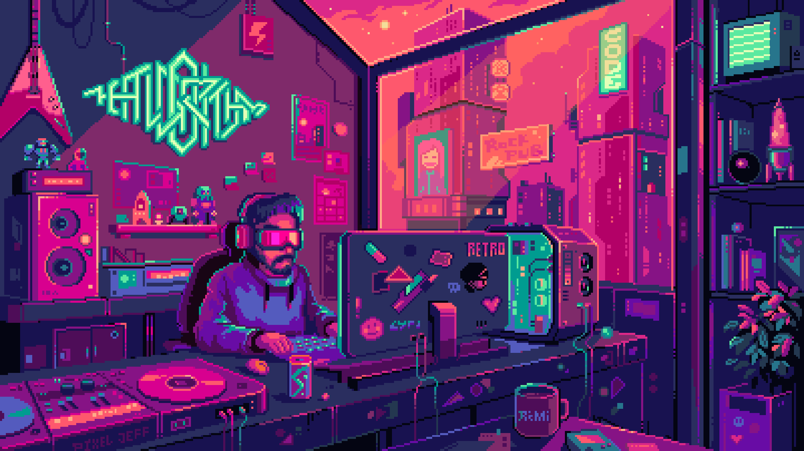

````md
<!--
  ╔══════════════════════════════════════════════════════════════════╗
  ║                        RaiZen094                                 ║
  ║            Software Engineering • DevOps • Systems              ║
  ╚══════════════════════════════════════════════════════════════════╝
-->

<!-- =============================================================== -->
<!-- HERO                                                            -->
<!-- =============================================================== -->

<div align="center">

# Hey, I'm RaiZen 👋

### `Software Engineer • Full-stack Developer • DevOps Enthusiast`

<p>
  I build things that are
  <b>clean</b>,
  <b>scalable</b>,
  <b>fast</b>,
  and preferably
  <b>automated</b>.
</p>

<p>
  🎓 BUET CSE &nbsp;•&nbsp;
  ⚽ Real Madrid &nbsp;•&nbsp;
  🗡️ Sanemi &nbsp;•&nbsp;
  ⚡ Zenitsu
</p>

<br/>

<!-- Anime GIF — kept unchanged -->


<br/><br/>

<!-- QUICK LINKS -->

<a href="https://raizen094.github.io/">
  
</a>

<a href="mailto:raiyan.fzs845@gmail.com">
  
</a>

<a href="https://www.linkedin.com/in/golam-mostofa-4b5357359">
  
</a>

<br/><br/>


</div>

---

<!-- =============================================================== -->
<!-- ABOUT                                                            -->
<!-- =============================================================== -->

## `> whoami`

```txt
raiZen@github:~$ ./about_me

🎓  BUET CSE
💻  Full-stack + Backend + DevOps
🧠  C / C++ / Java / Python / Rust
⚙️  I enjoy turning ideas into production-ready systems
☁️  Containers, CI/CD, cloud deployment and automation
🗄️  PostgreSQL / Oracle
🔥  Currently improving APIs, pipelines and developer experience

raiZen@github:~$ echo $PHILOSOPHY

"Build it. Break it. Understand it. Automate it."
````

---

<!-- =============================================================== -->

<!-- TECH STACK                                                       -->

<!-- =============================================================== -->

<div align="center">

## ⚡ Engineering Arsenal

<sub>
The tools and technologies I actually enjoy building with.
</sub>

<br/><br/>

### `LANGUAGES`


  


  


  


  


<br/><br/>

### `FRONTEND`


  


<br/><br/>

### `BACKEND`


  


<br/><br/>

### `DATABASES`


  


<br/><br/>

### `DEVOPS & CLOUD`


  


  


</div>

---

<!-- =============================================================== -->

<!-- WHAT I BUILD                                                     -->

<!-- =============================================================== -->

## 🛠️ What I Like Building

<table>
<tr>

<td width="50%" valign="top">

### 🌐 Full-stack Systems

I like building applications where the frontend isn't just pretty and the backend isn't held together by prayers.

```text
React / Next.js
       ↓
    REST APIs
       ↓
 Node / Spring
       ↓
PostgreSQL / Oracle
```

</td>

<td width="50%" valign="top">

### ⚙️ Backend Engineering

I care about the things users usually never see:

* API design
* Data modeling
* Authentication
* Authorization
* Validation
* Error handling
* Maintainability
* Testing
* Performance
* Developer experience

</td>

</tr>

<tr>

<td width="50%" valign="top">

### 🐳 DevOps

Taking:

```text
"It works on my machine."
```

and turning it into:

```text
"It works everywhere."
```

Containerized services, reproducible environments and automated delivery pipelines.

</td>

<td width="50%" valign="top">

### ☁️ Delivery

Removing repetitive manual work from the development lifecycle.

```text
Code
 ↓
GitHub
 ↓
CI / Tests
 ↓
Docker
 ↓
Azure
 ↓
Production 🚀
```

</td>

</tr>
</table>

---

<!-- =============================================================== -->

<!-- CURRENT FOCUS                                                    -->

<!-- =============================================================== -->

<div align="center">

## 🔥 Current Focus

</div>

```yaml
currently_exploring:

  backend:
    - typed APIs
    - scalable service design
    - clean architecture
    - production-ready APIs

  devops:
    - CI/CD pipelines
    - containerized workflows
    - cloud deployment
    - deployment automation

  engineering:
    - maintainable systems
    - better developer experience
    - faster feedback loops
    - writing cleaner code

rule:
  - "If it can be automated, automate it."
```

---

<!-- =============================================================== -->

<!-- ENGINEERING STYLE                                                -->

<!-- =============================================================== -->

<div align="center">

## 🧠 How I Think About Engineering

</div>

<table>
<tr>

<td width="25%" align="center" valign="top">

### `01`

### Understand

Know what you're building
before choosing how to build it.

</td>

<td width="25%" align="center" valign="top">

### `02`

### Build

Turn ideas into
something real.

</td>

<td width="25%" align="center" valign="top">

### `03`

### Break

Find the assumptions
that don't survive reality.

</td>

<td width="25%" align="center" valign="top">

### `04`

### Improve

Refactor. Automate.
Repeat.

</td>

</tr>
</table>

---

<!-- =============================================================== -->

<!-- DEV WORKFLOW                                                     -->

<!-- =============================================================== -->

## ⚙️ My Preferred Development Loop

```text
          ┌───────────────┐
          │     IDEA      │
          └───────┬───────┘
                  │
                  ▼
          ┌───────────────┐
          │    DESIGN     │
          └───────┬───────┘
                  │
                  ▼
          ┌───────────────┐
          │     BUILD     │
          └───────┬───────┘
                  │
                  ▼
          ┌───────────────┐
          │     TEST      │
          └───────┬───────┘
                  │
                  ▼
          ┌───────────────┐
          │   AUTOMATE    │
          └───────┬───────┘
                  │
                  ▼
          ┌───────────────┐
          │     SHIP      │
          └───────┬───────┘
                  │
                  ▼
          ┌───────────────┐
          │    IMPROVE    │
          └───────┬───────┘
                  │
                  └───────────────↺
```

---

<!-- =============================================================== -->

<!-- PRINCIPLES                                                       -->

<!-- =============================================================== -->

## 🧩 Things I Care About

```diff
+ Clean APIs
+ Predictable systems
+ Good abstractions
+ Useful automation
+ Reproducible environments
+ Maintainable code
+ Strong fundamentals
+ Simple solutions to complicated problems

- Unnecessary complexity
- Manual repetitive work
- "We'll fix it later"
- Production debugging at 3 AM
```

---

<!-- =============================================================== -->

<!-- GITHUB STATS                                                     -->

<!-- =============================================================== -->

<div align="center">

## 📊 GitHub Transmission

<br/>


<br/><br/>


</div>

---

<!-- =============================================================== -->

<!-- ACTIVITY GRAPH                                                   -->

<!-- =============================================================== -->

<div align="center">

## 📈 Contribution Activity


</div>

---

<!-- =============================================================== -->

<!-- CODE PHILOSOPHY                                                  -->

<!-- =============================================================== -->

<div align="center">

## 💭 Code Philosophy

</div>

```python
class RaiZen:

    mindset = [
        "understand the problem",
        "build the simplest correct solution",
        "measure before optimizing",
        "automate repetitive work",
        "keep learning"
    ]

    def solve(self, problem):
        understand(problem)
        build()
        test()
        break_things()
        improve()
        ship()

        return "better than yesterday"
```

---

<!-- =============================================================== -->

<!-- FUN SECTION                                                      -->

<!-- =============================================================== -->

## 🎮 Outside the Terminal

```txt
football        → Real Madrid ⚽
anime           → Demon Slayer
favorites       → Sanemi 🗡️ + Zenitsu ⚡
debugging       → print() until enlightenment
coffee          → probably required
automation      → yes
```

---

<!-- =============================================================== -->

<!-- CONTACT                                                          -->

<!-- =============================================================== -->

<div align="center">

## 🌐 Find Me Somewhere on the Internet

<br/>

<a href="mailto:raiyan.fzs845@gmail.com">
  
</a>

<a href="https://www.linkedin.com/in/golam-mostofa-4b5357359">
  
</a>

<a href="https://raizen094.github.io/">
  
</a>

<a href="https://your-cdn.com/Resume_RaiZen094.pdf">
  
</a>

<br/><br/>

---

### `「 Code. Ship. Learn. Repeat. 」`

<sub>
⚡ Powered by curiosity, caffeine, questionable debugging decisions,
and an unreasonable desire to automate everything.
</sub>

<br/><br/>


</div>

<!-- =============================================================== -->

<!-- EOF                                                              -->

<!-- =============================================================== -->

```
```
